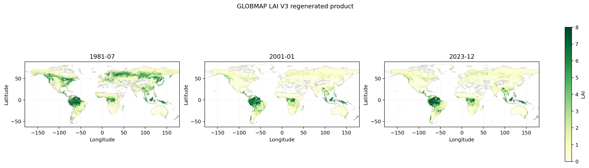
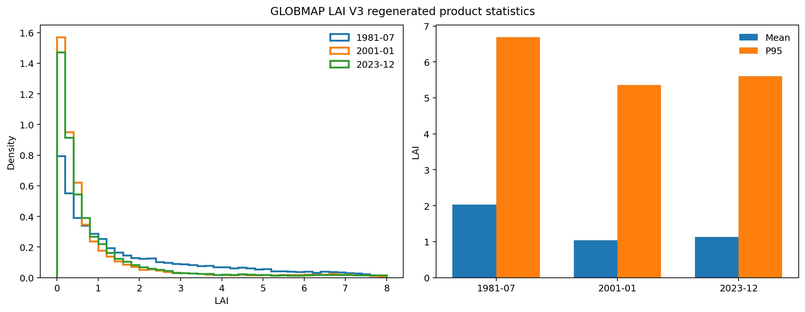

# GLOBMAP LAI V3 1981 2023 Reproduced Dataset

我们基于 GIMMS NDVI、MODIS MOD09A1 C6 反射率、MCD12Q1 土地覆盖、500 m global clumping index 和 GLOBCARBON LUT 等原始输入，重新生成了 1981–2023 年全球叶面积指数数据，并同步提供完整生产代码、质量控制结果和制图成果。

## Overview

本数据集覆盖全球陆地，空间范围为 180°W–180°E、63°S–90°N，空间分辨率约为 0.0727273°（约 8 km）。1981–2000 年时间分辨率为半月，2001 年起为 8 天。输出采用 HDF4 格式，科学数据集名称为 `LAI`。

## Methodology

我们首先对 MOD09A1 C6 反射率进行 state QA 筛选，并计算：

```text
NDVI = (NIR - RED) / (NIR + RED)
SR   = (1 + NDVI) / (1 - NDVI)
```

随后使用按生物群区分的 GLOBCARBON 四尺度几何光学模型 LUT，从 MODIS SR 反演 effective LAI，并根据 500 m 像元级 clumping index 计算：

```text
LAI_true = LAI_effective / Omega
```

对于 MODIS 时序中的云污染和短时缺测，我们使用局地调整三次样条方法进行缺口填补，并使用邻近有效观测进行上下限约束。

在 2000–2006 年重叠期，我们针对每个输出像元拟合 Huber 鲁棒关系：

```text
LAI_true(t) = a(x) + b(x) * SR_AVHRR(t)
```

在此基础上，我们将像元级关系应用于 1981–2000 年 AVHRR/GIMMS 数据，完成历史 LAI 回推，并输出 RMSE、R² 和有效观测数等质量控制指标。

## Data Details

- 时间范围：1981–2023
- 空间网格：2091 × 4950
- 空间分辨率：约 0.0727273°
- 时间分辨率：1981–2000 年半月，2001 年起 8 天
- 数据格式：HDF4
- 科学数据集：`LAI`
- 存储类型：int16
- 有效存储范围：0–1000
- 缩放因子：0.01
- 实际单位：m² m⁻²

## Production Code

| 文件 | 作用 |
| --- | --- |
| `code/reproduce/globmap_io.py` | 原始输入、HDF4 和网格处理 |
| `code/reproduce/biophysical.py` | QA、植被指数、LUT 反演、集聚校正和时序重建 |
| `code/reproduce/fusion.py` | AVHRR–MODIS 像元级标定、后备关系和历史回推 |
| `code/reproduce/export.py` | HDF4 编码和质量控制层输出 |
| `code/reproduce/run.py` | 完整生产流程 |
| `code/production/config.yaml` | 输入路径、时间范围、网格和输出配置 |

## Figures





示例图片由我们使用重新生成的 HDF 数据制作，展示 1981、2001 和 2023 年代表时段的全球空间格局及统计分布。


